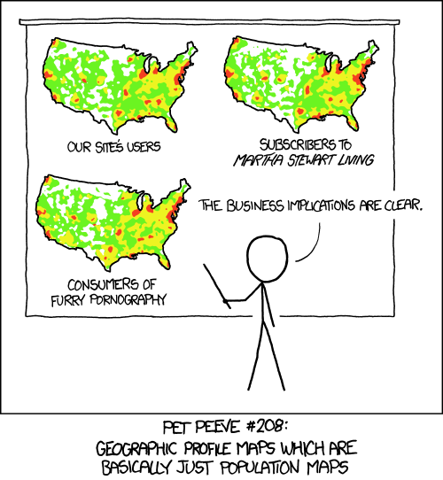

## Tonight's Menu {.smaller}

```{r, echo = FALSE, include=FALSE}
packages = c("ggplot2", "roxygen2", "devtools", "gridExtra", "mvtnorm",
             "dplyr", "fortunes", "ggthemes", "scales", "wesanderson")
lapply(packages, library, character.only = T)
theme_set(theme_bw(8))
```

- Quick review
- Final Projects: Quick examples
- Best practices in graphics
    - What comparisons are humans good at?
    - Axes: when should they start from 0?
    - Ordering categorical variables
    - Chartjunk
    - Aesthetics
    - Polishing graphs in R
- Best practices in workflow
- Best practices in programming
    - Documentation
    - Don't's and Do's
    - Warnings and errors
    - Getting help
    - Debugging

## Quick Review

Things you should know off the top of your head

- AIC: which direction is better? 
- What's the difference between AIC and BIC? 
- Looking at a residuals plot (residuals vs fitted values), what pattern would make you think "I need to transform or try a Poisson GLM?" 
- What does the linear predictor ($X\beta$) in logistic regression predict?
- Should you blindly trust in the results of stepwise regression? 

## Quick Review - answers

Things you should know off the top of your head

- AIC: which direction is better? *Lower is better.*
- What's the difference between AIC and BIC? *BIC penalizes extra parameters based on the log of the number of observations*
- Looking at a residuals plot (residuals vs fitted values), what pattern would make you think "I need to transform or try a Poisson GLM?" *variance that increases with the fitted value, "funnel" or "cone" shape*
- What does the linear predictor ($X\beta$) in logistic regression predict? *The log odds,* $\log(p / (1-p))$
- Should you blindly trust in the results of stepwise regression? **NO!**

# Final Project Examples

## Best practices in data visualization

- Know your audience
- Infographics vs. statistical graphics
- Remove clutter, de-emphasize annotations
- Use color, but don't try to *highlight* everything
    - drawing attention to one thing is often done best by muting other colors
- Don't lie: single y-axis, starting at 0 if appropriate
- Maps: show more than population or area

## How do we judge graphics?

[Kaiser Fung](http://junkcharts.typepad.com/junk_charts/junk-charts-trifecta-checkup-the-definitive-guide.html), a successful "visualization critic", evaluates graphs in three areas, **QDV: Question, Data, and Visualization**. 
- Does the graphic pose a clear, interesting question?
- Is the data suitable for the question---should it be transformed or smoothed?
- Is the visualization clear, concise, engaging, and does it address the question?

What do you think of this list?

## What can your eye compare?

Lengths and positions are easy to compare. Angles and areas are difficult.
A handful of distinct colors can be clear, and a color spectrum is useful, but trying to use more than 6 or 7 distinct colors is difficult. A few shapes or linetypes are okay for a discrete scale.

```{r, fig.width= 6, fig.height=2, echo=FALSE}
dd = data.frame(val = c(0.2, 0.16, 0.24, .13, .27),
                var = LETTERS[1:5])

pie = ggplot(dd, aes(x = factor(1), y = val, fill = var)) +
    geom_bar(position = "stack", stat = "identity", width = 1) +
    coord_polar(theta = "y") + theme_minimal(base_size = 4) +
    labs(x = "", y = "", fill = "") +
    scale_x_discrete(labels = "", breaks = NULL) +
    scale_y_continuous(labels = "", breaks = NULL) +
    scale_fill_discrete(guide = FALSE) + 
    theme(panel.grid = element_blank())

bar = ggplot(dd, aes(x = reorder(var, X = -val), y = val)) + 
    geom_bar(stat = "identity", fill = "dodgerblue4") + 
    labs(x = "", y = "") + 
    scale_y_continuous(labels = percent)

dot = ggplot(dd, aes(x = val, y = reorder(var, X = val))) +
    geom_point() +
    scale_x_continuous(labels = percent) +
    labs(x = "", y = "")

grid.arrange(pie, bar, dot, nrow = 1)
```

Bars and dots scale up better with more categories, and they generalize into small multiples with different totals.

---

*If you do use area*, make sure your scale maps **linearly** to area. A common mistake is to map a variable to both length *and* width, hence area corresponds to the *square* of the variable, which can be misleading

## Chartjunk {.smaller}

De-clutter!---within reason.

Edward Tufte drew attention to the *data-ink* ratio, and says it should be maximized. This can be taken too far---it's important to maintain accessibility for your graph.

That said, de-emphasize annotations (grid lines, axes, boxes, legends, etc.). They should be there if you look for them, but the focus of the chart should be the data.

---

```{r}
mtplot = ggplot(mtcars, aes(x = disp, y = mpg)) + geom_point()
grid.arrange(
    mtplot,
    mtplot +
        theme(
            panel.grid.major = element_line(color = "black"),
            panel.border = element_rect(color = "black", fill = NA),
            axis.text = element_text(color = "black")
        ),
    nrow = 1
)
```


## Aesthetics
  
Use color! Use soft, muted colors---don't try to emphasize everything.

The default ggplot colors are evenly spaced along the HCL color wheel. It's a default that works okay, and is usually distinguishable. You're better off with carefully chosen palettes, such as those in `RColorBrewer` (accessible via ggplot), other color palette packages `wesanderson`, or your company's colors. Also see `scales::muted()` to tone down too-bright colors.

```{r, echo=FALSE, fig.height= 0.5, fig.width=2}
wes_palette("Zissou")
wes_palette("GrandBudapest2")
```

I like to use dark but not-black colors for single-color data. My favorite is `"dodgerblue4"`. I find it more engaging.

## Axes

There are few almost-always rules:

- If time is a dimension, it should go on the horizontal axis
- For bar charts, the comparison is lengths of bars, so you should start the y-axis at 0.

## Maps



If your data is tied to population (area), but is **not** population (area), use a rate or a percent.

## Maps

Other map advice:

- Use a decent projection for you area. In `ggplot`, use `coord_map`.
- A warning: if you do maps in R, the order of the points matters. If you get something that looks like broken glass, the order of rows in your data frame got mixed up.
    - When augmenting geo data with other data, `base::merge` is sloppy about order, `dplyr::left_join` is much safer.)

## Polishing graphs

- If possible, label points and lines directly instead of relying on a legend (`annotate()` is useful for this in ggplot).
- Preparing a graph for production, you should finalize the graph *in the correct format and size.*
    - Get it "close" in R, then save it to a file for final polishing.
    - Find viewers that will automatically update when the file changes, such as Sumatra PDF on Windows, Preview on MacOS.
- Custom changes can be made manually in Adobe Illustrator or Inkscape. You don't want to do it until your graph is final, but you have ultimate freedom.
    - The new `cowplot` package also offers powerful customization of ggplots, like watermarks, overlays, rotations, etc.
    
## Saving graphs

- The `cairoDevice` package has generally superior algorithms for saving images. For a *nice* graphic, I'll usually save it with, e.g., `ggsave(..., type = "cairo-png"`. This requires that you have the `cairoDevice` package. It tends to especially make a difference for text legibility of raster graphics.
    - Cairo Device provides replacements for all the basic device commands, `png`, `pdf`, `jpeg`, etc. You can use it independently of `ggsave`.

Embed fonts in your PDFs `embedFonts` or `extrafont::embed_fonts`. The `extrafont` package is generally very good for importing "non-standard" fonts.

## Customizing ggplot themes

Sometimes the themes available built-in and in `ggthemes` aren't enough. You can tweak them or completely build your own: [there's a whole vignette on theming](http://docs.ggplot2.org/dev/vignettes/themes.html).

Also, don't forget the two standard themes arguments: `base_size` for adjusting font sizes, and `base_family` for font.

Time permitting, we can do some examples in class.


## Best practices in workflow

Above all else, your work should be reproducible. You should be able to go back to an old project, re-run everthing, and get the same results again. And, as a bonus, understand your thought process.

This means documenting your process, either with in-script comments or by replacing your script with a .Rmd file.

## Separate tasks

Typically a mature project workflow can be separated into discrete steps:

- define project-specific utility functions
- data extraction (if scripted)
- data preparation
- exploration
- modeling
- presentation

---

Depending on the size of the project, it can be nice to separate these steps into different scripts. Each script can end with saving its results (as nicely compressed .RData files), and the next script begins by loading the appropriate data. You can save any R objects in an RData file, data frames, vectors, fitted models, ggplots, ...

A very simple project / small task will have one script that does everything.

As projects get bigger, it becomes more manageable to separate out scripts by purpose.

**Always save a copy of your data in the form you get it.**

## Organizing files for a big project {.smaller}

- SQL query (.sql file) that pulls my data from a database
- `1extract.R` reads in the SQL query and sends it to the database. It saves the output exactly as I get it as `raw.RData` so that if the database is updated I have records
- `2transform.R`reads in `raw.RData` does lots of transformation, renaming, etc., getting the data ready for moeling. It saves out `processed.RData`
- `3explore.Rmd` reads in `processed.RData`, makes some graphs, tries out some models with lots of comments along the way. I worked on this iteratively with the `transform` script
- `4model.R` reads in `processed.RData`, based on what I learned exploring, it builds the model framework that I want, but I still have some variable selection to do, which it does using cross validation (using BIC as my metric). Saves out `finalmodel.RData`
- `5results.Rmd` reads in the final model and the processed data and makes nice, presentation/publication-ready graphics and tables
- `0project.R` sources all of the other scripts in order.

It's really messier than that - I have several modeling scripts, (4.1, 4.2, ...) where I tried out different approaches. The processed data might have a couple data frames, maybe training and test for cross validation... The above is an ideal to shoot for.

## Version control

Not having a back-up is a problem for the previous decade. You should *at the least* be saving everything to Dropbox or a similar product (OneDrive, Google Drive), or to a network drive that's backed up regularly.

Better yet, is using a version control system, the popular choices being Git and SVN. Combined with cloud storage, this gives you great power over different versions of your product, and they are especially useful for collaboration. (See optional reading on the course website).

## Managing R Package Versions

Two new-ish packages have come out to help you manage package versions for a project:

- `checkpoint` is from the Revolution R people (now Microsoft R). They take daily snapshots of all the packages on CRAN so that you can specify a date and use the versions of all packages as they were on that date.
- `packrat` is from the RStudio people (including Hadley). It will create a little library folder for your project (on your computer) and install the packages you need into that directory so you have your own copies of them.

## `packrat` vs. `checkpoint`

They both have pros and cons:

- Flexibility: `packrat` will let you "mix and match" sources and versions of packages (e.g., one package from Github + last year's version of `ggplot2`), `checkpoint` works only for CRAN packages using concurrent versions.

- Portability: `packrat` keeps all the files locally--which could get a little big---and it would require sharing all the files with someone else. `checkpoint` relies on a server hosted at Microsoft to store the packages.

## Best practices in programming
    
**Documentation**

We've talked about documentation a lot already, but I can't make a "best practices" list without including it.

## Don't use `eval(parse())`

```{r}
fortunes::fortune(106)
```

You can do a lot of tricky things with `eval(parse())`. (It takes a string and evaluates it as R code, so you can paste together code to run.) The obvious problem with `eval(parse())` is readability---it's a good way to obscure what you're doing. It's very hard to write straightforward, not-tricky code with `eval(parse())`.

## Alternatives to `eval(parse())`

Many people fall into the `eval(parse())` trap when they have a bunch of related variables, maybe they want data frames `d1, d2, d3, ...`. **Use a list instead**. 

Another common misuse is trying to use column names stored in strings with `$`. This is where you should use `[` instead.

## Don't use `assign`, and especially don't use `<<-` (global assign shortcut)

```{r}
fortunes::fortune(236)
```

The simple trouble with `assign` is that it can be used to cause side-effects, which will throw off users and be very confusing. The complicated trouble with `assign` is that the side-effects can depend on whether the function is called from the console or from inside a function or from a function inside a package... `assign` doesn't play well with others.
    
## **Do** use whitespace

```{r}
fortune(165)
```

Also use a consistent style. There's a Google R Style Guide, which is similar to Hadley's R Style Guide, and other too. It doesn't much matter what style you use, as long as it is consistent and clear.

## Warnings and errors and messages (oh my!)

There are four main ways R code can print to the console:

- `print()`/`cat()` statements, this is the typical method to give output requested by the user. (Printing values of a variable, printing a model summary, etc.)
- **errors** are printed when the code stops because it can't continue. They are most commonly produced by the `stop()` command (though I also like `stopIfNot` for input checking).
- **warnings** are printed when something *might* be wrong. You can produce them with `warning()`. The blog entry in this week's reading has a low view of warnings; in some cases I agree.
- **messages** are "none of the above". The prototypical message would be something like a progress bar for a long process. Another example is `dplyr::left_join` messaging the columns you're joining by if you don't specify. Some authors will just use `print` instead of `message` for such purposes, which is poor practice.

## Avoiding errors

Errors completely stop code from being executed, which is generally what you want to do if a certain step can't work. Sometimes, however, you want to try to do something, and if it errors out, do something else instead. This can be done with `try()` and `tryCatch()`. `tryCatch` is the more fully-featured version.

This is getting in to more advanced R programming. If you're interested, the best explanation I've found is in [this Stack Overflow answer](http://stackoverflow.com/a/12195574/903061).

## Debugging
    
```{r}
fortunes::fortune(158)
```

`browser()` pauses a function in the middle and lets you see what's going on, and you can step through the remainder of the function line by line. RStudio makes this point-and-click.

Never forget that you can run tiny snippets of code!

Most bugs are the result of a faulty assumption, isolate the problem as much as possible. Run you code one line at a time, and look at your variables each step of the way.

If you have a big function that errors out, `traceback()` will show you the call stack at the time of the error, which can help you isolate exactly where the error occurred.

## Getting help

I've found Stack Overflow to be an amazing help resource. You'll get very speedy and high-quality help there if you ask a high-quality question. Make sure you

- state your problem clearly
- state the requirements for the solution (and don't include unnecessary requirements for *how* the solution works)
- provide self-contained, reproducible code
- show what you tried
- read similar questions before posting

